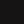
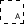
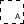
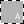
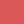
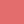
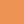
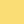
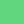
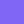

# phocus

Is a color scheme that comes with clean, opinionated and technical debt free implementations (themes) for various tools.

## Colors

The colors are grouped into three different types:

### Surface colors

For interface backgrounds that fill most of the area available and only have little contrast to each other. (roughly 1.07:1 contrast between neighboring colors)

| | Name | HEX | RGB(A) | HSL(A) |
|  - |  - |  - |  - |  - |
|  | one | `#0A0A0A` | `rgb(10, 10, 10)` | `hsl(0, 0%, 3.9%)` |
|  | two | `#151414` | `rgb(21, 20, 20)` | `hsl(0, 2.4%, 8%)` |
|  | three | `#1C1C1C` | `rgb(28, 28, 28)` | `hsl(0, 0%, 11%)` |
|  | four | `#242424` | `rgb(36, 36, 36)` | `hsl(0, 0%, 14.1%)` |
|  | five | `#2B2B2B` | `rgb(43, 43, 43)` | `hsl(0, 0%, 16.9%)` |
|  | elevate | `#FFFFFF0F` | `rgba(255, 255, 255, 0.06)` | `hsla(0, 0%, 100%, 0.06)` |

The `elevate` color is a very transparent color from the opposite lightness spectrum than the rest, that can be used to create a highlight on any of the other surface colors. This can be used for form elements or hover states.

### Line colors

Neutral light and dark colors used for typography, icons, borders and other fine lines.

| | Name | Type | HEX | RGB(A) | HSL(A) |
| - | - | - | - | - | - |
|  | light | strong | `#FFFFFF` | `rgb(255, 255, 255)` | `hsl(0, 0%, 100%)` |
|  | light | normal | `#FFFFFFEE` | `rgba(255, 255, 255, 0.93)` | `hsla(0, 0%, 100%, 0.93)` |
|  | light | weak | `#FFFFFF5C` | `rgba(255, 255, 255, 0.36)` | `hsla(0, 0%, 100%, 0.36)` |
|  | light | mute | `#FFFFFF19` | `rgba(255, 255, 255, 0.1)` | `hsla(0, 0%, 100%, 0.1)` |
|  | dark | strong | `#000000` | `rgb(0, 0, 0)` | `hsl(0, 0%, 0%)` |
|  | dark | normal | `#000000E6` | `rgba(0, 0, 0, 0.9)` | `hsla(0, 0%, 0%, 0.9)` |
|  | dark | weak | `#0000004C` | `rgba(0, 0, 0, 0.3)` | `hsla(0, 0%, 0%, 0.3)` |
|  | dark | mute | `#00000014` | `rgba(0, 0, 0, 0.082)` | `hsla(0, 0%, 0%, 0.082)` |

### Accent colors

Vibrant colors used as both surface and line colors, when something needs to stand out. Light types have a 1.2:1 contrast to their corresponding normal version.

| | Name | Type | HEX | RGB(A) | HSL(A) |
| - | - | - | - | - | - |
|  | red | normal | `#DA5858` | `rgb(218, 88, 88)` | `hsl(0, 63.7%, 60%)` |
|  | red | light | `#E36D6D` | `rgb(227, 109, 109)` | `hsl(0, 67.8%, 65.9%)` |
|  | orange | normal | `#ED9454` | `rgb(237, 148, 84)` | `hsl(25, 81%, 62.9%)` |
|  | orange | light | `#FCA669` | `rgb(252, 166, 105)` | `hsl(25, 96.1%, 70%)` |
|  | yellow | normal | `#E8CA5E` | `rgb(232, 202, 94)` | `hsl(47, 75%, 63.9%)` |
|  | yellow | light | `#FADD75` | `rgb(250, 221, 117)` | `hsl(47, 93%, 72%)` |
|  | green | normal | `#3FC661` | `rgb(63, 198, 97)` | `hsl(135, 54.2%, 51.2%)` |
|  | green | light | `#61D67E` | `rgb(97, 214, 126)` | `hsl(135, 58.8%, 61%)` |
|  | cyan | normal | `#5CD8E6` | `rgb(92, 216, 230)` | `hsl(186, 73.4%, 63.1%)` |
|  | cyan | light | `#7EEAF6` | `rgb(126, 234, 246)` | `hsl(186, 87%, 72.9%)` |
|  | blue | normal | `#497EE9` | `rgb(73, 126, 233)` | `hsl(220, 78.4%, 60%)` |
|  | blue | light | `#5D8DEE` | `rgb(93, 141, 238)` | `hsl(220, 81%, 64.9%)` |
|  | purple | normal | `#7154F2` | `rgb(113, 84, 242)` | `hsl(251, 85.9%, 63.9%)` |
|  | purple | light | `#8066F5` | `rgb(128, 102, 245)` | `hsl(251, 87.7%, 68%)` |
|  | pink | normal | `#D56CC3` | `rgb(213, 108, 195)` | `hsl(310, 55.6%, 62.9%)` |
|  | pink | light | `#DF81CF` | `rgb(223, 129, 207)` | `hsl(310, 59.5%, 69%)` |
