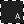
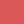
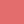
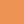
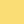
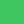
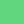
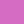
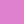

# phocus

Is a color scheme that comes with clean, opinionated and technical debt free implementations (themes) for various tools.

## Colors

The colors are separated into two groups:

### Surface colors

Interface backgrounds that fill most of the area available and only have little contrast to each other.

| | Type | HEX | RGB | HSL |
|  - |  - |  - |  - |  - |
|  | strongest | `#0A0A0A` | `rgb(10, 10, 10)` | `hsl(0, 0%, 4%)` |
|  | strong | `#141414` | `rgb(20, 20, 20)` | `hsl(0, 0%, 8%)` |
|  | moderate | `#1C1C1C` | `rgb(28, 28, 28)` | `hsl(0, 0%, 11%)` |
|  | weak | `#222222` | `rgb(34, 34, 34)` | `hsl(0, 0%, 13%)` |
|  | weakest | `#282828` | `rgb(40, 40, 40)` | `hsl(0, 0%, 16%)` |

> adjacent surface colors have roughly a contrast of 1.07:1

### Accent colors

Monochromatic color sets used to elevate or emphasize things, such as element surfaces, texts, lines and icons.

#### Monochrome accent colors

Are used to elevate **neutral** things depending on their importance.

| | Name | Type | HEX | RGB | HSL |
| - | - | - | - | - | - |
|  | white | strongest | `#FFFFFF` | `rgb(255, 255, 255)` | `hsl(0, 0%, 100%)` |
|  | white | strong | `#FFFFFFDE` | `rgba(255, 255, 255, 0.87)` | `hsla(0, 0%, 100%, 0.87)` |
|  | white | moderate | `#FFFFFF57` | `rgba(255, 255, 255, 0.34)` | `hsla(0, 0%, 100%, 0.34)` |
|  | white | weak | `#FFFFFF23` | `rgba(255, 255, 255, 0.14)` | `hsla(0, 0%, 100%, 0.14)` |
|  | white | weakest | `#FFFFFF0F` | `rgba(255, 255, 255, 0.06)` | `hsla(0, 0%, 100%, 0.06)` |
|  | black | strongest | `#000000` | `rgb(0, 0, 0)` | `hsl(0, 0%, 0%)` |
|  | black | strong | `#000000DE` | `rgba(0, 0, 0, 0.87)` | `hsla(0, 0%, 0%, 0.87)` |
|  | black | moderate | `#0000006B` | `rgba(0, 0, 0, 0.42)` | `hsla(0, 0%, 0%, 0.42)` |
|  | black | weak | `#00000026` | `rgba(0, 0, 0, 0.15)` | `hsla(0, 0%, 0%, 0.15)` |
|  | black | weakest | `#0000000F` | `rgba(0, 0, 0, 0.06)` | `hsla(0, 0%, 0%, 0.06)` |

#### Saturated accent colors

Are used to elevate **special** and **important** things.

| | Name | Type | HEX | RGB | HSL |
| - | - | - | - | - | - |
|  | red | normal | `#DA5858` | `rgb(218, 88, 88)` | `hsl(0, 64%, 60%)` |
|  | red | light | `#E36D6D` | `rgb(227, 109, 109)` | `hsl(0, 68%, 66%)` |
|  | orange | normal | `#ED9454` | `rgb(237, 148, 84)` | `hsl(25, 81%, 63%)` |
|  | orange | light | `#FCA669` | `rgb(252, 166, 105)` | `hsl(25, 96%, 70%)` |
|  | yellow | normal | `#E8CA5E` | `rgb(232, 202, 94)` | `hsl(47, 75%, 64%)` |
|  | yellow | light | `#FADD75` | `rgb(250, 221, 117)` | `hsl(47, 93%, 72%)` |
|  | green | normal | `#3FC661` | `rgb(63, 198, 97)` | `hsl(135, 54%, 51%)` |
|  | green | light | `#61D67E` | `rgb(97, 214, 126)` | `hsl(135, 59%, 61%)` |
|  | cyan | normal | `#5CD8E6` | `rgb(92, 216, 230)` | `hsl(186, 73%, 63%)` |
|  | cyan | light | `#7EEAF6` | `rgb(126, 234, 246)` | `hsl(186, 87%, 73%)` |
|  | blue | normal | `#497EE9` | `rgb(73, 126, 233)` | `hsl(220, 78%, 60%)` |
|  | blue | light | `#5D8DEE` | `rgb(93, 141, 238)` | `hsl(220, 81%, 65%)` |
|  | purple | normal | `#7154F2` | `rgb(113, 84, 242)` | `hsl(251, 86%, 64%)` |
|  | purple | light | `#8066F5` | `rgb(128, 102, 245)` | `hsl(251, 88%, 68%)` |
|  | pink | normal | `#D56CC3` | `rgb(213, 108, 195)` | `hsl(310, 56%, 63%)` |
|  | pink | light | `#DF81CF` | `rgb(223, 129, 207)` | `hsl(310, 59%, 69%)` |

> light and normal color types have roughly a contrast of 1.2:1